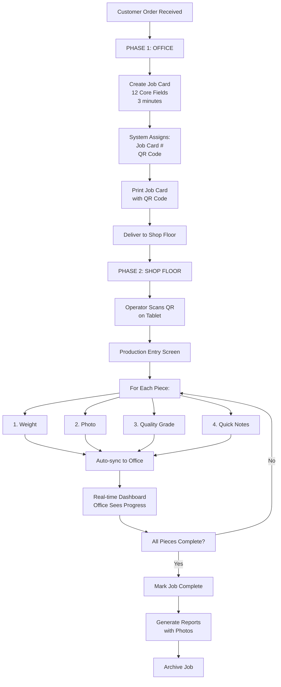
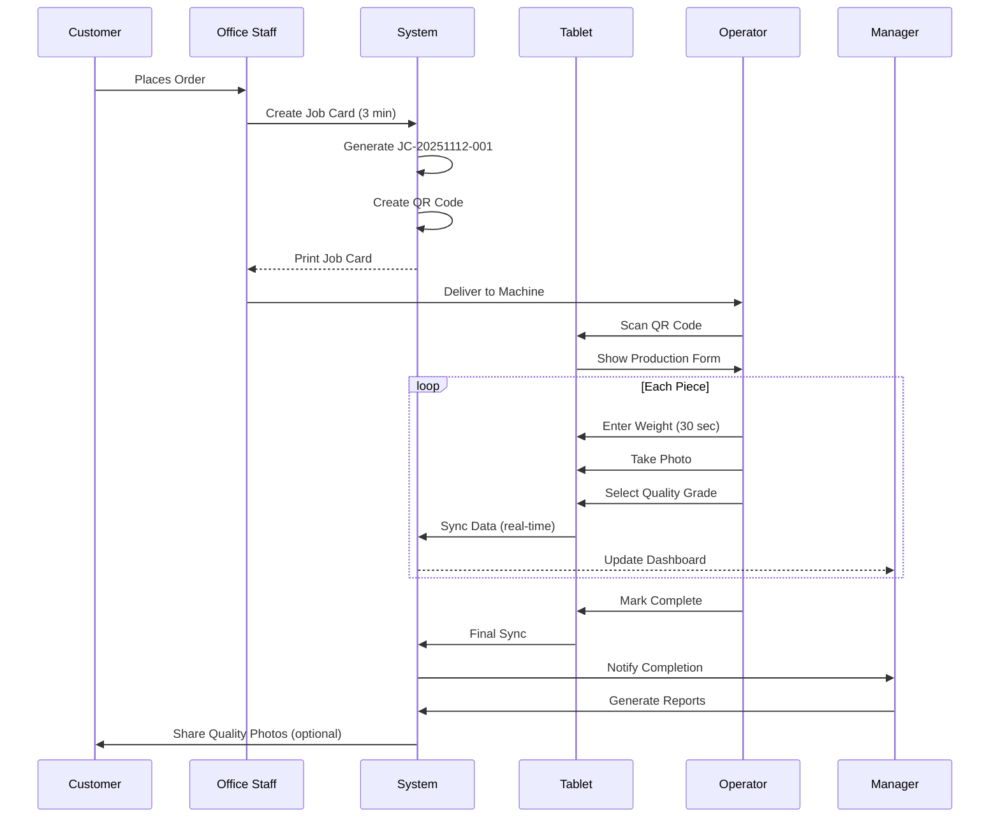
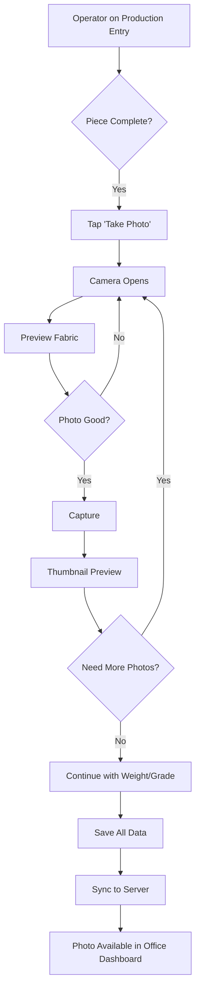
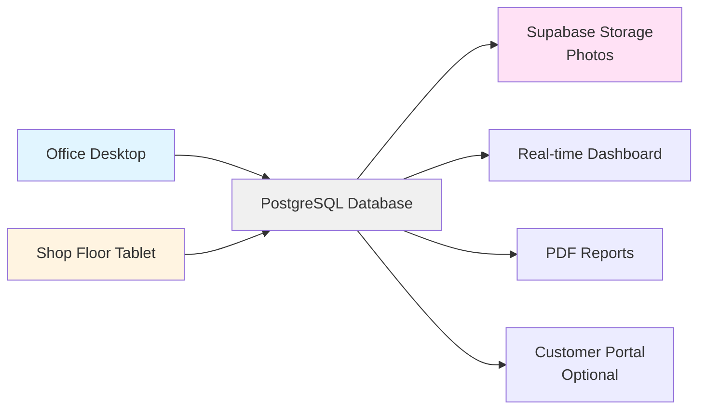
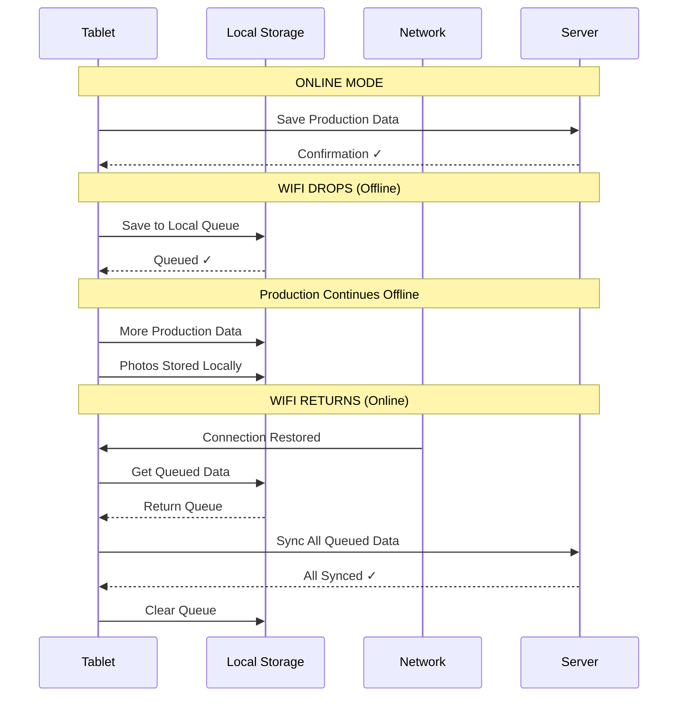
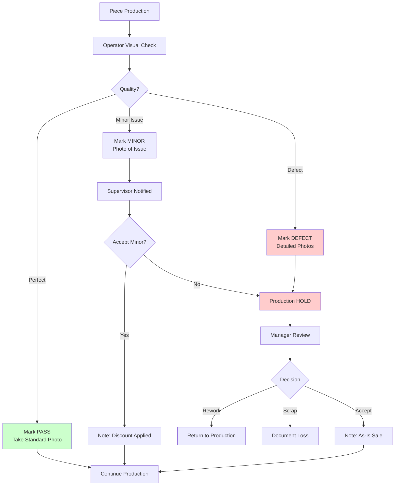

# Gilnokie Production Workflow - Visual Diagrams

## Proposed Two-Phase System



## Office vs Shop Floor Data Split

```mermaid
graph LR
    subgraph OFFICE["🏢 OFFICE SYSTEM (Desktop)"]
        A1[Customer Details]
        A2[Order Specs]
        A3[Fabric Quality]
        A4[Quantity Required]
        A5[Machine Assignment]
        A6[Target Date]
        A7[Yarn Planning]
        A8[Cost Estimates]
    end

    subgraph SHOPFLOOR["🏭 SHOP FLOOR (Tablet)"]
        B1[Actual Weight]
        B2[Photos]
        B3[Quality Grade]
        B4[Operator Name]
        B5[Timestamp]
        B6[Defects]
        B7[Machine Issues]
        B8[Progress %]
    end

    OFFICE -->|QR Code| SHOPFLOOR
    SHOPFLOOR -->|Real-time Sync| OFFICE
```



## Data Flow Timeline



## Screen Layout Comparison

### Office Desktop - Job Card Creation
```
┌─────────────────────────────────────────────┐
│  CREATE JOB CARD                        [X] │
├─────────────────────────────────────────────┤
│                                             │
│  [Tabs: Order | Fabric | Production | Notes]│
│                                             │
│  ┌─────────────────┐  ┌──────────────────┐ │
│  │ Customer ▼      │  │ Order Date       │ │
│  └─────────────────┘  └──────────────────┘ │
│                                             │
│  ┌─────────────────┐  ┌──────────────────┐ │
│  │ Fabric Quality▼ │  │ Quantity (kg)    │ │
│  └─────────────────┘  └──────────────────┘ │
│                                             │
│  [     Cancel     ] [   Create Job Card  ] │
└─────────────────────────────────────────────┘
```

### Shop Floor Tablet - Production Entry (Landscape)
```
┌─────────────────────────────────────────────────────────────┐
│  📋 Job Card: JC-20251112-001                          🔋95% │
│  Customer: MACBEAN | Quality: PD600 | Target: 500kg         │
├─────────────────────────────────────────────────────────────┤
│                                                               │
│   Current Piece: 12 / 20                   Progress: 60%    │
│                                                               │
│   ┌─────────────────────────┐                                │
│   │  WEIGHT (kg)            │   ┌───────────────────────┐   │
│   │                         │   │                       │   │
│   │      35.5               │   │   📷  TAKE PHOTO      │   │
│   │                         │   │                       │   │
│   │  [1][2][3]   [←]        │   │   (Camera Preview)    │   │
│   │  [4][5][6]   [OK]       │   │                       │   │
│   │  [7][8][9]              │   └───────────────────────┘   │
│   │  [.][0][⌫]              │                                │
│   └─────────────────────────┘                                │
│                                                               │
│   QUALITY GRADE:                                             │
│   ┌──────────┐ ┌──────────┐ ┌──────────┐                   │
│   │  ✓ PASS  │ │  MINOR   │ │  DEFECT  │                   │
│   │  (Green) │ │ (Yellow) │ │   (Red)  │                   │
│   └──────────┘ └──────────┘ └──────────┘                   │
│                                                               │
│   NOTES: ________________________________________________    │
│                                           [🎤 Voice Input]    │
│                                                               │
│   [      ← PREVIOUS      ]  [    SAVE & NEXT PIECE →    ]  │
│                                                               │
└─────────────────────────────────────────────────────────────┘
```

## Photo Capture Flow



## User Interface Principles

### Desktop (Office)
- **Layout**: Standard form layout, multiple tabs
- **Input**: Keyboard and mouse
- **Target Size**: Standard (24px buttons acceptable)
- **Density**: Information-dense, multiple fields visible
- **Use Case**: Detailed planning, reporting, analysis

### Tablet (Shop Floor)
- **Layout**: Single-focus, one task at a time
- **Input**: Touch only (gloves possible)
- **Target Size**: Large (minimum 44px, prefer 60px+)
- **Density**: Minimal, reduce cognitive load
- **Use Case**: Quick data entry during production
- **Orientation**: Landscape (easier to hold and read)
- **Contrast**: High (visible in bright factory lighting)

## Integration Points



## Offline Capability



## Quality Control Workflow



## Dashboard Real-Time Updates

```
MANAGER DASHBOARD VIEW:

┌───────────────────────────────────────────────────────────┐
│  ACTIVE PRODUCTION                              🔄 Live   │
├───────────────────────────────────────────────────────────┤
│                                                           │
│  JC-20251112-001  MACBEAN   PD600                       │
│  ████████████░░░░░░░░ 60% (12/20 pieces)                │
│  Machine 3 | Operator: John | Last update: 2 min ago     │
│  📷 Latest photo: [thumbnail] Quality: ✓ PASS            │
│                                                           │
│  JC-20251112-002  TurboTex  T3                          │
│  ██░░░░░░░░░░░░░░░░░░ 10% (2/18 pieces)                 │
│  Machine 7 | Operator: Sarah | Last update: 15 min ago   │
│  ⚠️ MINOR DEFECT detected - Review needed                │
│  📷 [View defect photos]                                  │
│                                                           │
│  JC-20251112-003  MACBEAN   MED102                      │
│  ░░░░░░░░░░░░░░░░░░░░ 0% (0/25 pieces)                   │
│  Machine 5 | Waiting for operator...                     │
│                                                           │
└───────────────────────────────────────────────────────────┘
```

---

**These diagrams illustrate the complete proposed workflow.**
**Present to client for feedback before proceeding with build.**
